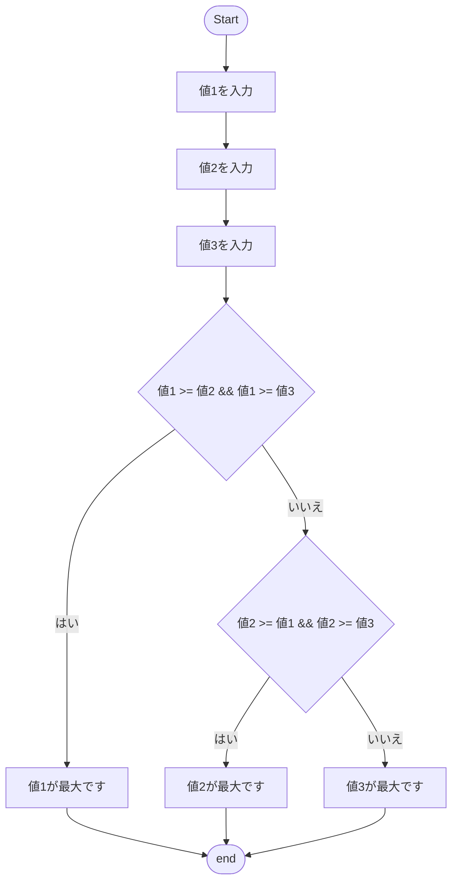

```mermaid
flowchart TD
    A([Start]) --> B[値1を入力]
    B --> C[値2を入力]
    C --> D[値3を入力]
    D --> E{値1 >= 値2 && 値1 >= 値3}
    E --はい--> F[値1が最大です]
    E --いいえ--> G{値2 >= 値1 && 値2 >= 値3}

    G--はい-->H[値2が最大です]
    G--いいえ-->I[値3が最大です]

    F --> END([end])
    H --> END([end])
    I --> END([end])

```