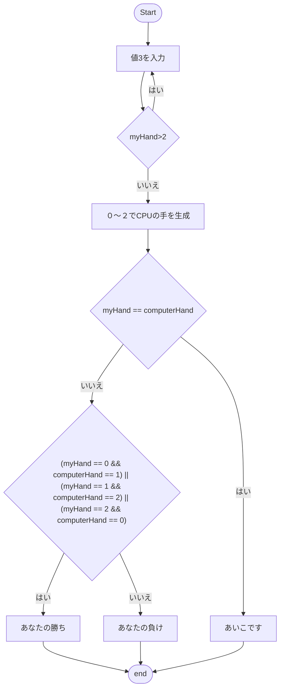

```mermaid
flowchart TD
    A([Start]) --> B[0:グー　1:チョキ　2:パーでmyHandを入力]
    B --> C{myHand>2}
    C --はい--> B[値3を入力]
    C --いいえ--> D[０〜２でCPUの手を生成]

    D --> E{myHand == computerHand}
    E --はい--> AIKO[あいこです]
    E --いいえ--> G{"(myHand == 0 && computerHand == 1) || (myHand == 1 && computerHand == 2) || (myHand == 2 && computerHand == 0)"}

    G--はい-->H[あなたの勝ち]
    G--いいえ-->I[あなたの負け]

    H --> END([end])
    I --> END([end])
    AIKO --> END([end])

```